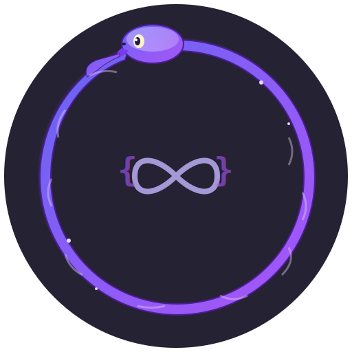

<p align="center">
  
</p>

<h1 align="center">Ouroboros</h1>

<p align="center">
  
  
  <a href="https://dotnet.microsoft.com/download/dotnet/10.0"></a>
  <a href="https://www.nuget.org/packages/LangChain/"></a>
</p>

A **sophisticated functional programming-based AI pipeline system** (YET EXPERIMENTAL) built on LangChain, implementing category theory principles, monadic composition, and functional programming patterns to create robust, self-improving AI agents.

## Repository Structure

This repository uses **git submodules** to compose the full system from independent sub-repos:

| Submodule | Repository | Description |
|-----------|-----------|-------------|
| `.build/` | [ouroboros-build](https://github.com/PMeeske/ouroboros-build) | Shared build config, CI templates, TestKit |
| `foundation/` | [ouroboros-foundation](https://github.com/PMeeske/ouroboros-foundation) | Core, Domain, Tools, Genetic, Roslynator |
| `engine/` | [ouroboros-engine](https://github.com/PMeeske/ouroboros-engine) | Agent, Pipeline, Providers, Network |
| `app/` | [ouroboros-app](https://github.com/PMeeske/ouroboros-app) | Application, CLI, WebApi, Android, Easy |

### Build Inheritance

```
ouroboros-build (Directory.Build.props)         ← Base: analyzers, lang version, warnings
    │
    ├── ouroboros-foundation                    ← Layer: Foundation (no upstream deps)
    │
    ├── ouroboros-engine                        ← Layer: Engine (depends on Foundation)
    │
    └── ouroboros-app                           ← Layer: App (depends on Foundation + Engine)
```

## Key Features

- **Monadic Composition** — Type-safe pipeline operations using `Result<T>` and `Option<T>` monads
- **Kleisli Arrows** — Mathematical composition of computations in monadic contexts
- **LangChain Integration** — Native provider/tool integration with pipe operators (`Set | Retrieve | Template | LLM`)
- **Meta-AI Layer v2** — Planner/Executor/Verifier orchestrator with continual learning
- **Self-Improving Agents** — Automatic skill extraction and learning from successful executions
- **Phase 2 Metacognition** — Agent self-model, goal hierarchy, capability registry, self-evaluation
- **Integrated Self-Model** — Identity graph, global workspace, predictive monitoring, self-explanation
- **Epic Branch Orchestration** — Auto agent assignment, dedicated branches, parallel sub-issue processing
- **Phase 0 Evolution** — Feature flags, DAG maintenance, global projection service
- **MeTTa Symbolic Reasoning** — Hybrid neural-symbolic AI integration
- **Event Sourcing** — Complete immutable audit trail with replay
- **RecursiveChunkProcessor** — Adaptive chunking and map-reduce for large contexts (100+ pages)
- **Multi-Provider Support** — Anthropic, OpenAI, Ollama, GitHub Models, LiteLLM, and more
- **Cost Tracking** — Built-in LLM usage cost tracking with session summaries
- **IONOS Cloud Ready** — Optimized for Kubernetes deployment

## Architecture

```
┌─────────────────┐    ┌─────────────────┐    ┌─────────────────┐
│   Core Layer    │    │  Domain Layer   │    │ Pipeline Layer  │
│ • Monads        │───▶│ • Events        │───▶│ • Branches      │
│ • Kleisli       │    │ • States        │    │ • Vectors       │
│ • Steps         │    │ • Vectors       │    │ • Ingestion     │
└─────────────────┘    └─────────────────┘    └─────────────────┘
         │                       │                       │
         └───────────────────────┼───────────────────────┘
                                 ▼
                    ┌─────────────────┐
                    │Integration Layer│
                    │ • Tools         │
                    │ • Providers     │
                    │ • Memory        │
                    └─────────────────┘
```

Pipeline steps are modeled as **Kleisli arrows** `A → M<B>` where `M` is the `Result` monad. Composition `(A → M<B>) >=> (B → M<C>)` yields `A → M<C>` — if any step fails, the failure propagates automatically.

See **[Architecture Overview](engine/docs/ARCHITECTURE.md)** and **[Architectural Layers](engine/docs/ARCHITECTURAL_LAYERS.md)** for full details.

## Getting Started

### Prerequisites

- [.NET 10.0 SDK](https://dotnet.microsoft.com/download/dotnet/10.0) or later
- [Ollama](https://ollama.ai/) (for local LLMs) or remote API access (optional)

### Clone & Build

```bash
git clone --recurse-submodules https://github.com/PMeeske/Ouroboros-v2.git
cd Ouroboros-v2
dotnet restore && dotnet build
```

### First-Time Setup

```bash
cd app/src/Ouroboros.CLI
dotnet run -- setup --all    # Guided wizard: Ollama, auth, MeTTa, vector DB
```

### Quick Usage

```bash
cd app/src/Ouroboros.CLI
dotnet run -- ask -q "What is functional programming?"
dotnet run -- pipeline -d "SetTopic('AI') | UseDraft | UseCritique | UseImprove"
dotnet run -- orchestrator --goal "Explain monads"
```

See **[Quick Start Guide](app/docs/QUICKSTART.md)** | **[CLI Examples](app/docs/OVERPOWERED_CLI_EXAMPLES.md)** | **[CLI Quick Reference](app/docs/CLI_METTA_QUICKREF.md)** for comprehensive CLI documentation.

### Programmatic Usage

```csharp
// Convenience layer
var ai = Ouroboros.Create(chatModelName: "llama3", embeddingModelName: "nomic-embed-text");
var answer = await ai.AskAsync("What is a monad?");
var ragAnswer = await ai.AskWithRagAsync("How does the project handle errors?");

// Core pipeline composition with Kleisli arrows
var draft = ReasoningArrows.DraftArrow(llm, tools, embed, "Explain monads", "draft");
var critique = ReasoningArrows.CritiqueArrow(llm, tools, embed, "draft", "critique");
var improve = ReasoningArrows.ImproveArrow(llm, tools, embed, "critique", "final");
var pipeline = draft.ComposeWith(critique).ComposeWith(improve);
var result = await pipeline(ReasoningState.Initial);
```

See **[Easy API Quick Start](app/docs/EASY_API_QUICKSTART.md)** for more programmatic examples.

## Project Structure

| Layer | Projects | Location |
|-------|----------|----------|
| **Foundation** | Core, Domain, Tools, Genetic, Roslynator | `foundation/src/` |
| **Engine** | Agent, Pipeline, Providers, Network | `engine/src/` |
| **App** | Application, CLI, WebApi, Android, Easy, Examples | `app/src/` |
| **Build** | TestKit, CI templates, build config | `.build/` |

## Development

```bash
# Run all tests
dotnet test

# Run layer-specific tests
dotnet test foundation/tests/**/*.csproj
dotnet test engine/tests/**/*.csproj
dotnet test app/tests/**/*.csproj

# Work on a specific layer (isolated AI context)
cd foundation && claude
cd engine && claude
```

### Working with Submodules

```bash
git submodule update --remote --merge   # Pull latest from all sub-repos
```

## Documentation

Each sub-repo contains its own `docs/` directory. Key guides:

### Getting Started
| Guide | Location |
|-------|----------|
| Quick Start | [app/docs/QUICKSTART.md](app/docs/QUICKSTART.md) |
| Configuration & Security | [app/docs/CONFIGURATION_AND_SECURITY.md](app/docs/CONFIGURATION_AND_SECURITY.md) |
| Troubleshooting | [app/docs/TROUBLESHOOTING.md](app/docs/TROUBLESHOOTING.md) |
| Contributing | [.build/docs/CONTRIBUTING.md](.build/docs/CONTRIBUTING.md) |

### Architecture & Design
| Guide | Location |
|-------|----------|
| Architecture Overview | [engine/docs/ARCHITECTURE.md](engine/docs/ARCHITECTURE.md) |
| Architectural Layers | [engine/docs/ARCHITECTURAL_LAYERS.md](engine/docs/ARCHITECTURAL_LAYERS.md) |
| Cognitive Architecture | [engine/docs/COGNITIVE_ARCHITECTURE.md](engine/docs/COGNITIVE_ARCHITECTURE.md) |
| Iterative Refinement | [engine/docs/ITERATIVE_REFINEMENT_ARCHITECTURE.md](engine/docs/ITERATIVE_REFINEMENT_ARCHITECTURE.md) |
| Self-Improving Agent | [engine/docs/SELF_IMPROVING_AGENT.md](engine/docs/SELF_IMPROVING_AGENT.md) |
| Arrow Composition | [foundation/docs/ARROW_COMPOSITION_EXAMPLES.md](foundation/docs/ARROW_COMPOSITION_EXAMPLES.md) |
| Laws of Form | [foundation/docs/LAWS_OF_FORM.md](foundation/docs/LAWS_OF_FORM.md) |

### Providers & Integration
| Guide | Location |
|-------|----------|
| Anthropic Claude | [engine/docs/ANTHROPIC_INTEGRATION.md](engine/docs/ANTHROPIC_INTEGRATION.md) |
| Ollama Cloud | [engine/docs/OLLAMA_CLOUD_INTEGRATION.md](engine/docs/OLLAMA_CLOUD_INTEGRATION.md) |
| GitHub Models | [engine/docs/GITHUB_MODELS_INTEGRATION.md](engine/docs/GITHUB_MODELS_INTEGRATION.md) |
| Vector Stores | [engine/docs/VECTOR_STORES.md](engine/docs/VECTOR_STORES.md) |
| MeTTa Neuro-Symbolic | [engine/docs/METTA_NEURO_SYMBOLIC_ARCHITECTURE.md](engine/docs/METTA_NEURO_SYMBOLIC_ARCHITECTURE.md) |

### Deployment & Infrastructure
| Guide | Location |
|-------|----------|
| Deployment Guide | [app/docs/DEPLOYMENT.md](app/docs/DEPLOYMENT.md) |
| Deployment Quick Reference | [app/docs/DEPLOYMENT-QUICK-REFERENCE.md](app/docs/DEPLOYMENT-QUICK-REFERENCE.md) |
| IONOS Deployment | [app/docs/IONOS_DEPLOYMENT_GUIDE.md](app/docs/IONOS_DEPLOYMENT_GUIDE.md) |
| Infrastructure Dependencies | [app/docs/INFRASTRUCTURE_DEPENDENCIES.md](app/docs/INFRASTRUCTURE_DEPENDENCIES.md) |
| Terraform + K8s | [app/docs/TERRAFORM_K8S_INTEGRATION.md](app/docs/TERRAFORM_K8S_INTEGRATION.md) |
| Android App | [app/src/Ouroboros.Android/README.md](app/src/Ouroboros.Android/README.md) |
| Web API | [app/src/Ouroboros.WebApi/README.md](app/src/Ouroboros.WebApi/README.md) |

### Testing & Quality
| Guide | Location |
|-------|----------|
| Test Coverage Report | [.build/docs/TEST_COVERAGE_REPORT.md](.build/docs/TEST_COVERAGE_REPORT.md) |
| Test Coverage Quick Ref | [.build/docs/TEST_COVERAGE_QUICKREF.md](.build/docs/TEST_COVERAGE_QUICKREF.md) |
| Mutation Testing Guide | [.build/docs/TEST_MUTATION_GUIDE.md](.build/docs/TEST_MUTATION_GUIDE.md) |
| Benchmark Suite | [foundation/docs/BENCHMARK_SUITE.md](foundation/docs/BENCHMARK_SUITE.md) |

## Requirements

- .NET 10.0 SDK
- Ollama (for local LLM execution)
- Docker (optional, for containerized execution)

## License

MIT — see [LICENSE](LICENSE).

## Acknowledgments

- [LangChain](https://github.com/langchain-ai/langchain) for the inspiration
- [Ollama](https://ollama.ai/) for making local LLMs accessible
- [MeTTa](https://github.com/trueagi-io/hyperon-experimental) for symbolic reasoning capabilities
